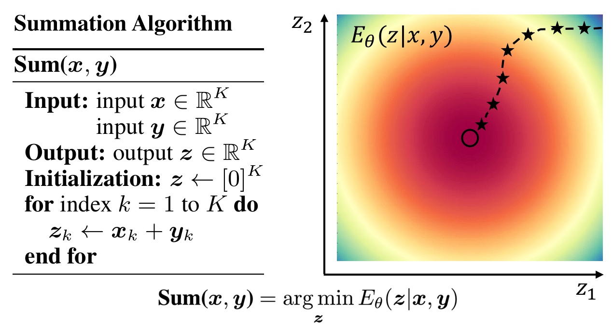

# Learning Iterative Reasoning through Energy Minimization

Yilun Du, Shuang Li, Joshua B. Tenenbaum, Igor Mordatch

A link to our paper can be found on [arXiv](https://arxiv.org/abs/2206.15448).

## Overview

Official codebase for [Learning Iterative Reasoning through Energy Minimization]().
Contains scripts to reproduce experiments.

<p align="center">
  
</p>

## Instructions

Please install the listed requirements.txt file.

```
pip install -r requirements.txt
```

We provide code for running continuous graph reasoning experiments in `graph_train.py` and code for running continuous matrix experiments in `train.py`.


To run continuous matrix addition experiments you utilize the following command:

```
python train.py --exp=addition_experiment --train --num_steps=10 --dataset=addition --train --cuda --infinite
```

To evaluate the final performance of the model after training, you may use the command:

```
python train.py --exp=addition_experiment  --num_steps=10 --dataset=addition --cuda --infinite --resume_iter=10000 
```

and the following command for the OOD training set:

```
python train.py --exp=addition_experiment  --num_steps=10 --dataset=addition --cuda --infinite --resume_iter=10000  --ood
```

We may substitute the flag --dataset with other keywords such as inverse or lowrank (as well as additional ones defined in dataset.py).


To run discrete graph reasoning experiments you may utilize the following command:

```
python graph_train.py --exp=identity_experiment --train --num_steps=10 --dataset=identity --train --cuda --infinite
```

We may substitute the flag --dataset with other datasets such as shortestpath or connected (as well as additional ones defined in graph\_dataset.py).


To evaluate the model, you may then utilize the following command:

```
python graph_train.py --exp=identity_experiment --num_steps=10 --dataset=identity --cuda --infinite  --resume_iter=10000
```

## Citation

Please cite our paper as:

```
@article{du2022irem,
  title={Learning Iterative Reasoning through Energy Minimization},
  author={Yilun Du and Shuang Li and Joshua B. Tenenbaum and Igor Mordatch},
  booktitle={Proceedings of the 39th International Conference on Machine 
                    Learning (ICML-22)},
  year={2022}
}
```

Note: this is not an official Google product.

## License

MIT
